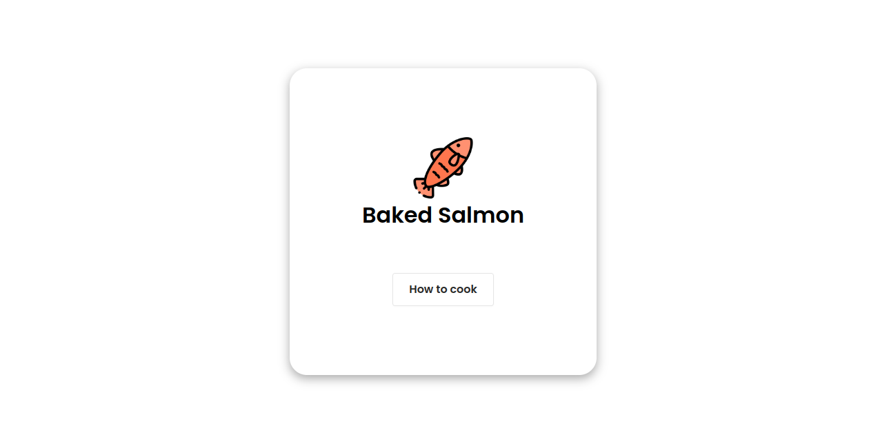
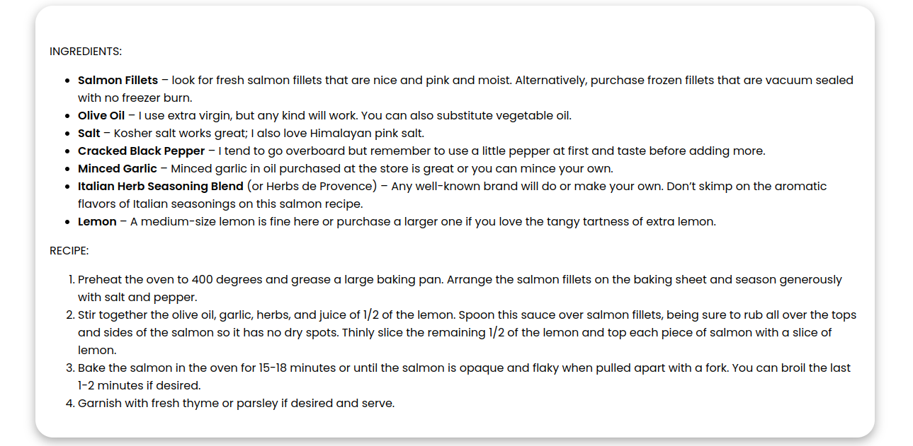

## 🍳Random Food 

## About Project
This project is made for people that don't know what to eat and instead of searching hours and hours for a good recipe, all you need is to run this project, and will instantly give you a random food with the recipe. If you don't like it, just refresh the page and generate another one.

This is a very simple project that takes a random value from the database and based on that, is rendering an image, title, and description. 

To add new food just use the Django admin system.

## Tasks
 
- [x] Create a function that will take random values

- [x] Make cool UI in templates

- [ ] Create user profiles

- [ ] Make random values non-repeating

- [ ] Add possibility to users to make their own list of food